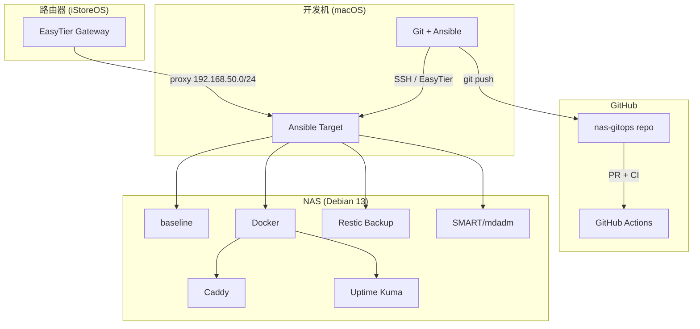

# NAS GitOps 开发规划

> 基于 [nas-gitops-plan-v3.1](nas-gitops-plan-v3.1-2026-03-21.md) | 更新时间：2026-03-22 (M2)

## 目标系统（已确认）

| 项目 | 值 |
|------|---|
| 主机 | 家用 NAS — Debian 13 (trixie), kernel 6.12.74 |
| CPU | Intel i5-9600KF 6C @ 3.70GHz |
| RAM | 16GB |
| 系统盘 | ~1TB (sda: EFI + ext4 + swap) |
| 数据盘 | 2×7.3TB HDD (sdb+sdc), mdadm RAID1 → /dev/md0 → /data |
| 网络 | LAN 192.168.50.10/24 (eno1), 家庭内网无防火墙需求 |
| 远程接入 | EasyTier 由路由器 (iStoreOS 192.168.50.1) 代理, NAS 不运行 EasyTier |
| 已安装 | openssh-server 10.0p1, nftables 1.1.3, mdadm 4.4, smartmontools 7.4, Docker 29.3.0, unattended-upgrades, restic |
| 容器服务 | Caddy 2.11.2 (反向代理), Uptime Kuma 2.2.1 (监控) |

## CI 结构（全部通过 ✅）

| Workflow | 文件 | 说明 |
|----------|------|------|
| CI | `.github/workflows/ci.yml` | yamllint + ansible-lint + shellcheck + shfmt + gitleaks |
| Molecule | `.github/workflows/molecule.yml` | 3 role syntax-check (baseline, docker, monitoring) |
| Deploy Test | `.github/workflows/deploy-test.yml` | syntax-check (严格) + `--check --diff` dry-run (参考) |

> **CI 策略原则**: role 代码保持纯净 (不加容器兼容 hack), CI 做语法和结构验证, 真实部署测试在 NAS 上执行。

## 开发规范

- **Lint**: `.ansible-lint` skip_list 仅保留 `galaxy[no-changelog]`
- **Task 命名**: `name[casing]` 遵循首字母大写 (`"Prefix | Description"`)
- **变量命名**: role 内变量加 role 前缀 (`baseline_xxx`, `docker_xxx`, `monitoring_xxx`)
- **Docker role**: 自建 (参考 geerlingguy.docker 8.0.0), 不再使用第三方 role
- **防火墙**: 不使用 (家庭内网), `nftables` 仅作为系统工具包安装

---

## M0：仓库与安全基础 ✅ 已完成

| 状态 | 交付物 | 说明 |
|:----:|--------|------|
| ✅ | `ansible.cfg` | SSH pipelining, `ansible.builtin.default` callback, 项目路径配置 |
| ✅ | `requirements.yml` | ansible.posix + community.docker + community.general |
| ✅ | `inventory/prod/` | hosts.yml + group_vars/all.yml + all.sops.yml |
| ✅ | `.sops.yaml` | 绑定 age 公钥, 自动加密 `*.sops.yml` |
| ✅ | `.yamllint.yml` | 120 char, true/false only |
| ✅ | `.ansible-lint` | skip_list 仅 galaxy[no-changelog] |
| ✅ | `.github/workflows/ci.yml` | yamllint + ansible-lint + shellcheck + shfmt + gitleaks |
| ✅ | `policy/check-compose-policy.sh` | 5 项策略检查 |
| ✅ | `CLAUDE.md` + `AGENTS.md` | AI agent 指引 |
| ✅ | `mise.toml` | Python 3.14.3 |
| ✅ | `requirements-dev.txt` | molecule + ansible-lint + yamllint 开发依赖 |

---

## M1：主机基线 ✅ 已完成

### Roles (3 个)

| Role | 路径 | 功能 |
|------|------|------|
| baseline | `ansible/roles/baseline/` | 包管理, hostname, timezone/NTP, SSH hardening, sysctl, unattended-upgrades |
| docker | `ansible/roles/docker/` | Docker CE 安装 (deb822 格式), daemon.json, compose plugin, user 管理 |
| monitoring | `ansible/roles/monitoring/` | smartmontools SMART 监控, mdadm RAID 监控 |

### Playbooks

| Playbook | 说明 |
|----------|------|
| `baseline.yml` | 编排 baseline + monitoring roles |
| `docker.yml` | 编排 docker role |
| `verify.yml` | 6 项验证: hostname, SSH, Docker, RAID, SMART, NTP |
| `bootstrap.yml` | 裸机 → Ansible 可管理 |

### 关键设计决策（已审计确认 2026-03-22）

- **sshd_config**: 基于 Debian 13 默认值 + hardening (key-only, PermitRootLogin no, AllowUsers kchou, X11Forwarding no)
- **timesyncd**: NTP 源 ntp.aliyun.com + time.apple.com, FallbackNTP 为 Debian 官方
- **sysctl**: `ip_forward=1` (与 Docker 兼容), 标准安全基线
- **Docker 安装**: 完全对齐 Docker 官方 2026-03 文档 (deb822, GPG key, docker-ce + buildx + compose)
- **无防火墙 role**: 家庭内网不需要, nftables 包仅作为系统工具安装

### 部署顺序

```bash
# 1. dry-run (首次部署前必须执行)
ansible-playbook -i inventory/prod ansible/playbooks/baseline.yml --check --diff
ansible-playbook -i inventory/prod ansible/playbooks/docker.yml --check --diff

# 2. 执行
ansible-playbook -i inventory/prod ansible/playbooks/baseline.yml
ansible-playbook -i inventory/prod ansible/playbooks/docker.yml

# 3. 验证
ansible-playbook -i inventory/prod ansible/playbooks/verify.yml
```

> ⚠️ 部署前确认: SSH key 已正确配置到 NAS (密码登录会被禁用)

---

## M2：备份与监控 ✅ 已完成

| 状态 | 交付物 | 说明 |
|:----:|--------|------|
| ✅ | `ansible/roles/restic/` | Restic 备份 role |
| | | systemd timer 定时备份 (每日 02:00) |
| | | 幂等 repo 初始化 + env 文件 (mode 0400) |
| | | 保留策略 (daily:7, weekly:4, monthly:6) |
| | | Nice=19 + IOSchedulingClass=idle 低影响 |
| ✅ | `scripts/alerts/notify.sh` | 统一通知框架 (Telegram) |
| ✅ | `scripts/alerts/check-smart.sh` | SMART 健康告警 |
| ✅ | `scripts/alerts/check-raid.sh` | RAID 状态告警 |
| ✅ | `scripts/alerts/check-disk.sh` | 磁盘空间告警 (阈值可配) |
| ✅ | `scripts/alerts/check-backup.sh` | 备份新鲜度告警 (25h) |
| ✅ | `compose/platform/uptime-kuma/` | Uptime Kuma 2.x docker-compose |
| | | 绑定 LAN IP, healthcheck, restart policy |
| ✅ | `ansible/playbooks/backup.yml` | 备份部署 playbook |
| ✅ | `docs/runbooks/disaster-recovery.md` | 灾难恢复 Runbook |
| ✅ | `docs/runbooks/disk-replacement.md` | RAID 换盘 Runbook |
| ✅ | `docs/runbooks/restore-from-backup.md` | 备份恢复 Runbook |

### M2 部署顺序

```bash
# M1 先部署完成后:
ansible-playbook -i inventory/prod ansible/playbooks/backup.yml --check --diff
ansible-playbook -i inventory/prod ansible/playbooks/backup.yml
# Uptime Kuma:
cd /opt/compose/platform/uptime-kuma && docker compose up -d
```

### M2 依赖

- M1 baseline + Docker 需先部署完成
- `restic_repo_password` 在 `all.sops.yml` 中
- `telegram_bot_token` + `telegram_chat_id` 在 `all.sops.yml` 中

---

## M3：平台入口 ✅ 已完成

| 状态 | 交付物 | 说明 |
|:----:|--------|------|
| ✅ | `compose/platform/caddy/` | Caddy 2.11.2 反向代理 |
| | | Caddyfile (HTTP, 绑定 LAN IP, auto_https off) |
| | | 路由到 Uptime Kuma (`/uptime/`) |
| ✅ | `ansible/playbooks/deploy.yml` | 统一部署 playbook (network + sync + compose up + 健康检查) |
| ✅ | `ansible/playbooks/rollback.yml` | 回滚 playbook (compose down + re-sync + compose up) |
| ✅ | `docs/runbooks/service-deploy.md` | 服务部署/更新/回滚 Runbook |
| ❌ | AI 服务 (Open WebUI) | 用户决定不需要，已移除 |

### M3 版本信息

| 服务 | 版本 | 确认来源 |
|------|------|----------|
| Caddy | 2.11.2 | GitHub API (2026-03-06) |
| Uptime Kuma | 2.2.1 | GitHub API (2026-03-10) |

### M3 依赖

- M1 baseline + Docker 需先部署完成
- M2 Uptime Kuma 建议先部署

---

## 后续优化 (M4+) 📋 规划中

| 优先级 | 方向 | 说明 |
|:------:|------|------|
| P1 | NAS 本地 Git 镜像 | cron daily `git clone --mirror` 到 /data |
| P1 | 部署标签自动化 | `deploy-YYYYMMDD-HHMM` tag |
| P2 | ADR 文档体系 | `docs/adr/` 架构决策记录 |
| P2 | Grafana + node-exporter | 可视化监控 (替代或补充 Uptime Kuma) |
| P3 | EasyTier NAS 端部署 | 如需 NAS 直接参与 mesh 而非路由器代理 |
| P3 | Ansible Vault migration | 如果 sops 不够用 |

---

## 技术栈总览


