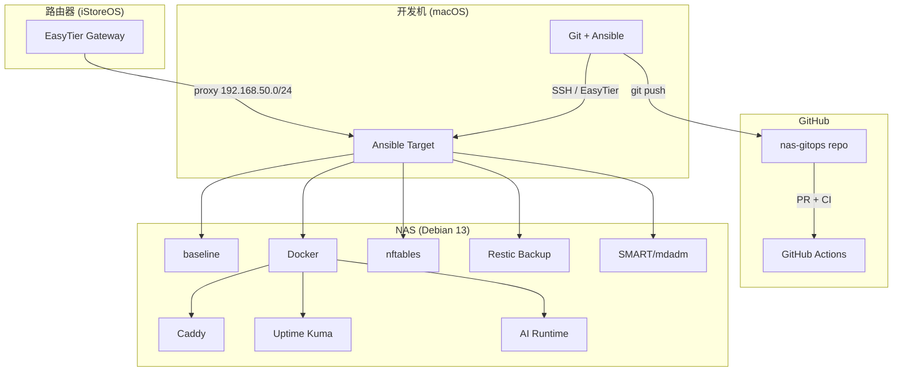

# NAS GitOps 开发规划

> 基于 [nas-gitops-plan-v3.1](nas-gitops-plan-v3.1-2026-03-21.md) | 更新时间：2026-03-21

## 目标系统

| 项目 | 值 |
|------|---|
| 主机 | 家用 NAS — Debian 13 (trixie) |
| CPU | Intel i5-9600KF 6C @ 3.70GHz |
| RAM | 16GB |
| 系统盘 | SSD/HDD (单盘) |
| 数据盘 | 2×8TB HDD, mdadm RAID1 → /data |
| 网络 | LAN 192.168.50.10/24, EasyTier 通过路由器 (iStoreOS) 代理 |
| 远程接入 | EasyTier only (零入站公网暴露) |

---

## M0：仓库与安全基础 ✅ 已完成

| 状态 | 交付物 | 说明 |
|:----:|--------|------|
| ✅ | `ansible.cfg` | SSH pipelining, YAML callback, 项目路径配置 |
| ✅ | `requirements.yml` | geerlingguy.docker 8.0.0 + ansible.posix + community.docker/general |
| ✅ | `inventory/prod/hosts.yml` | 生产 inventory, SSH config alias |
| ✅ | `inventory/prod/group_vars/all.yml` | 网络/系统/Docker/监控变量 |
| ✅ | `inventory/prod/group_vars/all.sops.yml` | sops + age 加密 secrets |
| ✅ | `.sops.yaml` | 绑定 age 公钥, 自动加密 `*.sops.yml` |
| ✅ | `.gitignore` | Python/Ansible/IDE/OS/secrets 排除 |
| ✅ | `.yamllint.yml` | 120 char, true/false only, 排除第三方 role |
| ✅ | `.ansible-lint` | 排除 geerlingguy.docker, 跳过 name[casing] |
| ✅ | `.github/workflows/ci.yml` | 5 jobs: ansible-lint, yamllint, shellcheck, shfmt, compose-check, gitleaks |
| ✅ | `.github/pull_request_template.md` | NAS 特定 checklist |
| ✅ | `.github/CODEOWNERS` | 所有变更需 owner review |
| ✅ | `policy/check-compose-policy.sh` | 5 项策略: no latest, no 0.0.0.0, healthcheck, restart, 端口绑定 |
| ✅ | `CLAUDE.md` | 23 条硬约束 + 命令参考 + skills 索引 |
| ✅ | `AGENTS.md` | 多 agent 兼容指引 (Claude/Codex/Gemini) |
| ✅ | `README.md` | 架构概述 + 快速开始 |
| ✅ | `.claude/skills/` | 3 个适配后的 Ansible skills |
| ✅ | `mise.toml` | Python 3.14.3 + precompiled flavor 配置 |

---

## M1：主机基线 ✅ 已完成

| 状态 | 交付物 | 说明 |
|:----:|--------|------|
| ✅ | `ansible/roles/baseline/` | SSH hardening (key-only, LAN IP 绑定, AllowUsers) |
| | | NTP (systemd-timesyncd + 国内源) |
| | | sysctl 安全加固 (rp_filter, no redirects, file-max) |
| | | 基础包安装 (curl, git, htop, tmux, nftables, restic...) |
| | | unattended-upgrades (security-only) |
| ✅ | `ansible/roles/nftables/` | INPUT DROP 默认策略 |
| | | LAN 子网 (192.168.50.0/24) only 放行 |
| | | `nft -c -f` validate 预检 |
| | | 可配置端口列表 + 额外端口扩展 |
| ✅ | `ansible/roles/monitoring/` | smartmontools SMART 定期检测 (short weekly, long monthly) |
| | | mdadm RAID 状态监控 + mdcheck timer |
| ✅ | `ansible/playbooks/bootstrap.yml` | 裸机 → Ansible 可管理 (Python3, sudo, SSH) |
| ✅ | `ansible/playbooks/baseline.yml` | 编排 baseline + nftables + monitoring roles |
| ✅ | `ansible/playbooks/docker.yml` | geerlingguy.docker + daemon.json 日志轮转 + 用户加入 docker 组 |
| ✅ | `ansible/playbooks/verify.yml` | 7 项验证: hostname, SSH, nftables, Docker, RAID, SMART, NTP |
| ✅ | `scripts/bootstrap.sh` | 灾难恢复用裸机引导脚本 |

### M1 部署顺序

```bash
# 1. dry-run
ansible-playbook -i inventory/prod ansible/playbooks/baseline.yml --check --diff
ansible-playbook -i inventory/prod ansible/playbooks/docker.yml --check --diff

# 2. 执行
ansible-playbook -i inventory/prod ansible/playbooks/baseline.yml
ansible-playbook -i inventory/prod ansible/playbooks/docker.yml

# 3. 验证
ansible-playbook -i inventory/prod ansible/playbooks/verify.yml
```

---

## M2：备份与监控 ⏳ 待开发

| 状态 | 交付物 | 说明 |
|:----:|--------|------|
| ⬚ | `ansible/roles/restic/` | Restic 备份 role |
| | | 安装 restic, 初始化 repo |
| | | systemd timer 定时备份 (/data, /opt/compose, /etc) |
| | | 备份前预检 (RAID status, mount status) |
| | | 备份后验证 (restic check) |
| | | 保留策略 (keep-daily:7, keep-weekly:4, keep-monthly:6) |
| ⬚ | `scripts/alerts/notify.sh` | 统一通知框架 (Telegram / webhook) |
| ⬚ | `scripts/alerts/check-smart.sh` | SMART 健康告警脚本 |
| ⬚ | `scripts/alerts/check-raid.sh` | RAID 状态告警脚本 |
| ⬚ | `scripts/alerts/check-disk.sh` | 磁盘空间告警脚本 |
| ⬚ | `scripts/alerts/check-backup.sh` | 备份状态告警脚本 |
| ⬚ | `compose/platform/uptime-kuma/` | Uptime Kuma docker-compose |
| | | 绑定 LAN IP, healthcheck, restart policy |
| | | ping 检查 + HTTP 检查 |
| ⬚ | `ansible/playbooks/backup.yml` | 备份部署 playbook |
| ⬚ | `docs/runbooks/disaster-recovery.md` | 灾难恢复 Runbook |
| ⬚ | `docs/runbooks/disk-replacement.md` | RAID 换盘 Runbook |
| ⬚ | `docs/runbooks/restore-from-backup.md` | 备份恢复 Runbook |

### M2 依赖

- M1 baseline + Docker 需先部署完成
- Restic 需要 `restic_repo_password` (已在 `all.sops.yml` 中)
- Telegram 通知需要 bot token + chat ID (已在 `all.sops.yml` 中)
- 异地备份需要 B2/S3 bucket (可后续配置)

---

## M3：平台入口与 AI 服务 ⏳ 待开发

| 状态 | 交付物 | 说明 |
|:----:|--------|------|
| ⬚ | `compose/platform/caddy/` | Caddy 反向代理 |
| | | Caddyfile 模板 (绑定 LAN/EasyTier IP) |
| | | TLS 内部自签证书 |
| | | 路由到 Uptime Kuma / AI 服务 |
| ⬚ | `compose/apps/ai-runtime/` | AI 服务 docker-compose |
| | | OpenWebUI / ChatGPT-Next-Web |
| | | LLM API 代理 |
| ⬚ | `ansible/playbooks/deploy.yml` | 统一部署 playbook (compose up) |
| ⬚ | `ansible/playbooks/rollback.yml` | 回滚 playbook (git tag + compose down/up) |
| ⬚ | `docs/runbooks/service-deploy.md` | 服务部署 Runbook |

### M3 依赖

- M1 baseline + Docker 需先部署完成
- M2 Uptime Kuma 可选 (但建议先部署)
- AI 服务的具体选型待确认

---

## 后续优化 (M4+) 📋 规划中

| 优先级 | 方向 | 说明 |
|:------:|------|------|
| P1 | NAS 本地 Git 镜像 | cron daily `git clone --mirror` 到 /data |
| P1 | 部署标签自动化 | `deploy-YYYYMMDD-HHMM` tag |
| P2 | ADR 文档体系 | `docs/adr/` 架构决策记录 |
| P2 | Grafana + node-exporter | 可视化监控 (替代或补充 Uptime Kuma) |
| P3 | EasyTier NAS 端部署 | 如需 NAS 直接参与 mesh 而非路由器代理 |
| P3 | Ansible Vault migration | 如果 sops 不够用 |

---

## 技术栈总览



## 当前 Git 历史

```
85ed6e0 feat(M1): 主机基线 roles + playbooks
2c3f1b3 fix(ci): 排除第三方 role 的 ansible-lint 检查
ecb62be fix(ci): yamllint 不支持 -e 参数，改用配置文件 ignore
fc4790e fix(ci): 修复 CI 报错
780b4ba M0: 初始化仓库骨架
```
